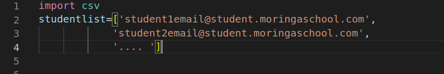
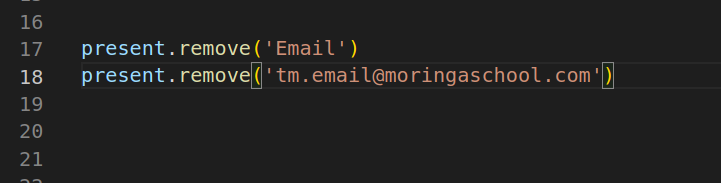

# ATTENDANCE REPORT (A MORINGA PROJECT)

## “The bad news is time flies. The good news is you’re the pilot.” – Michael Althsuler

### Businessmen like to say that “time is money” but it is much more than that. Time is our greatest asset, but it is what we choose to do with the time that we have available to us, that will define who we are and what you achieve in life. Time is one of the few things in life that you cannot get back.  [source-money101.co.za](https://money101.co.za/time-is-our-greatest-asset-use-it-wisely/#:~:text=Businessmen%20like%20to%20say%20that,that%20you%20cannot%20get%20back)

# DESCRIPTION 
### This simple project automates the task of attendance tracking in 4 simple steps
### 1 DOWNLOAD CSV FILE FROM GOOGLE MEET REPORTS AND PLACE IN PROJECT FOLDER
### 2 RENAME CSV FILE TO ATTENDANCE
### 3 RUN THE SCRIPT
### 4 GET A DETAILED REPORT
###      IVO TU

# SETUP
### - CLONE/FORK REPO - (whatever your intention is) 


## PRELIMINARY SET-UP
### THIS INVOLVES ADDING YOUR STUDENTS [EMAIL] IN THE ```studentlist``` VARIABLE PRESENT WITHIN THE CODE. It's a list(array)


### REMOVE UNNECESSARY FILES FIELDS FROM PARSED CSV, IN THIS CASE THE EMAIL FIELD ON LINE 1 ON CSV AND YOUR EMAIL, EDIT LINE 18
 


# IMPORTANT TO NOTE
## THE ALGORITHM MAKES A FEW ASSUMPTIONS
### 1. if the csv output parsed after removing default first line and tm email are the same length then it flags all students as present. 
### 2. In all instances it will flag all non Moringa School emails as foreign, together with students not in the studentlist and give report  


